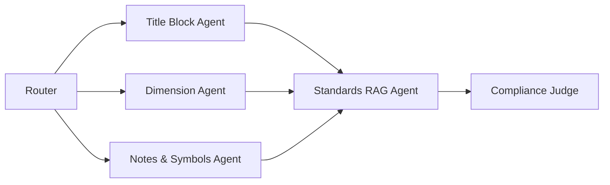

### Agent Architecture

   ## Milestone Mapping

- [x] **Week 2:** Checklist schema + architecture diagram
- [x] **Week 3:** `/review` stub with mock responses
- [ ] **Week 4–5:** Standards RAG ingestion
- [ ] **Week 6–7:** Specialist agents + multimodal pipeline
- [ ] **Week 8:** Judge + gold-set evaluation
- [ ] **Week 9–12:** UI with annotated findings overlay