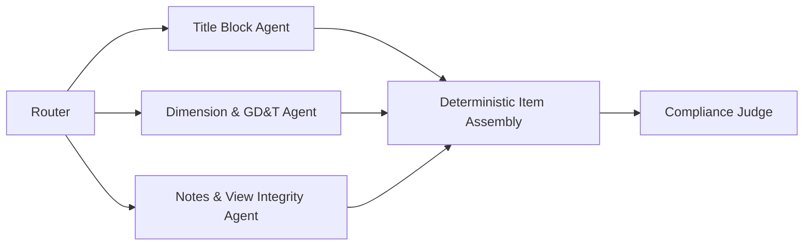

### Agent Architecture

## Milestone Mapping

- [x] **Week 2:** Checklist schema + architecture diagram
- [x] **Week 3:** `/review` endpoint with real LLM calls
- [x] **Week 4–5:** Standards RAG ingestion (instructor 20-item checklist)
- [x] **Week 6–7 (partial):** Specialist agents grounded in real drawing text descriptions from the instructor gold set (image/multimodal input not yet wired in)
- [x] **Week 8:** Judge + eval against instructor gold set subset
- [ ] **Week 9–12:** UI with annotated findings overlay

## System Architecture & Design Highlights (Iteration 1)

### 1. Data Validation & Schemas
ระบบใช้ **Pydantic** ในการจัดการและตรวจสอบ (Validate) โครงสร้างข้อมูลอย่างเข้มงวด ทั้งฝั่ง Input ที่ต้องระบุ `drawing_id` และ `drawing_type` ให้ชัดเจน และฝั่ง Output ที่บังคับให้ AI ตอบกลับมาในรูปแบบ Structured JSON เพื่อป้องกันระบบพังจากการตอบกลับที่ผิดรูปแบบ

### 2. Traceability & Debugging
การทำงานของระบบสามารถ **Trace (ตรวจสอบย้อนหลัง)** ได้ 100% ผ่านโครงสร้างของ Output JSON ที่ออกแบบไว้:
- `standard_ref`: ระบุชัดเจนว่าอ้างอิงมาตรฐานวิศวกรรมข้อใด (เช่น ISO 128, ASME Y14.5)
- `evidence`: ระบุเหตุผลหรือจุดที่พบข้อผิดพลาดบนแบบแปลนอย่างเป็นรูปธรรม
ทำให้ผู้ใช้งาน (มนุษย์) หรือทีม Developer สามารถเข้าใจสาเหตุของการตัดคะแนนได้อย่างโปร่งใส และใช้ในการ Debug ข้อมูลได้ทันที

### 3. Scalability & Maintainability
- **Maintainability:** กฎและมาตรฐานทางวิศวกรรมที่ใช้ตรวจ จะไม่ถูกฝังอยู่ในโค้ด (No Hardcoding) แต่จะถูกนำไปเก็บไว้ในระบบ **RAG (Knowledge Base)** หากในอนาคตมีการอัปเดตมาตรฐานวิศวกรรม หรือองค์กรต้องการเพิ่มเกณฑ์ใหม่ๆ ก็สามารถทำได้โดยการอัปโหลดไฟล์คู่มือเข้าไปใหม่ โดยไม่ต้องรื้อโค้ดของระบบ
- **Scalability & Routing:** มีการใช้ตัวแปร `drawing_type` เพื่อส่งแบบแปลนไปยัง Specialist Agent ที่ถูกต้อง (เช่น งานผลิตจะถูกตรวจเรื่อง Tolerance, งานโครงสร้างจะถูกตรวจเรื่อง Spec) รองรับการ Scale และเพิ่มประเภท Agent ในอนาคตได้อย่างยืดหยุ่น

## System Architecture & Design Highlights (Iteration 2)

**Goal:** End-to-end offline pipeline that uses the instructor data pack. ✅ met, with one caveat noted below.

### Agents
- **Router Agent** — classifies the drawing and gives specialist focus instructions. Structured output via `RouterDecision` (Pydantic).
- **Title Block Specialist** — evaluates `GENERAL_METADATA` checklist items (G01–G04).
- **Dimension & GD&T Specialist** — evaluates `DIMENSIONING_RULES` + `GDT_AND_TOLERANCING` items (D01–D05, T01–T05).
- **Notes & View Integrity Specialist** — evaluates `VIEW_INTEGRITY` + `MANUFACTURABILITY` items (V01–V04, M01–M02).
  Each specialist returns structured `SpecialistFindings` (Pydantic) — only `status` + `evidence` come from the LLM; `description` and `standard_ref` are filled deterministically from the knowledge base afterward, so the model can't hallucinate a standard reference.
- **Compliance Judge (LLM-as-judge)** — receives the already-assembled, deterministic item list and only decides `overall_status` + `open_questions`. It cannot alter or invent items, which keeps the grounding check honest.

### RAG Sources
- `knowledge_base.json` — instructor checklist `SOT-ENG-DRW-020`, 20 items across 5 categories (GENERAL_METADATA, VIEW_INTEGRITY, DIMENSIONING_RULES, GDT_AND_TOLERANCING, MANUFACTURABILITY), each tagged with its ASME/ISO standard reference.
- `standards_excerpt.md` — redacted ASME Y14.5 / ISO 128 / ISO 129-1 excerpt pack from the instructor bundle, kept as background reference context.
- `gold_set.json` — the 12-drawing instructor gold set (6 compliant / 6 with known issues) with per-drawing text descriptions and ground-truth failed item IDs. Used by `eval_script.py`.

### Eval
`eval_script.py` runs a 6-drawing subset (within the 5–10 range) of the 12-drawing gold set against the live `/review` endpoint and reports two metrics in `eval_report.md`:
- Overall status accuracy (pass/fail/review_required vs. gold)
- Exact failed-item-set accuracy (does the predicted set of failed item IDs match gold exactly)

### Known caveat
Drawing "content" is currently the instructor's **text description** of each drawing's issues (or lack thereof), not the drawing image itself — there is no multimodal/vision ingestion yet. This satisfies the Iteration 2 bar ("polished UI, full security audit, prompt versioning" explicitly not required yet) but means the pipeline is not yet reading actual drawing geometry. Wiring in the drawing images (e.g. via Gemini vision, or the Roboflow object-detection set for visual reference) is the natural next step before the Week 9–12 milestone.
