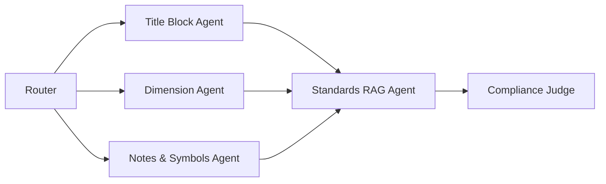

### Agent Architecture

   ## Milestone Mapping

- [x] **Week 2:** Checklist schema + architecture diagram
- [x] **Week 3:** `/review` stub with mock responses
- [ ] **Week 4–5:** Standards RAG ingestion
- [ ] **Week 6–7:** Specialist agents + multimodal pipeline
- [ ] **Week 8:** Judge + gold-set evaluation
- [ ] **Week 9–12:** UI with annotated findings overlay

## System Architecture & Design Highlights (Iteration 1)

### 1. Data Validation & Schemas
ระบบใช้ **Pydantic** ในการจัดการและตรวจสอบ (Validate) โครงสร้างข้อมูลอย่างเข้มงวด ทั้งฝั่ง Input ที่ต้องระบุ `drawing_id` และ `drawing_type` ให้ชัดเจน และฝั่ง Output ที่บังคับให้ AI ตอบกลับมาในรูปแบบ Structured JSON เพื่อป้องกันระบบพังจากการตอบกลับที่ผิดรูปแบบ

### 2. Traceability & Debugging
การทำงานของระบบสามารถ **Trace (ตรวจสอบย้อนหลัง)** ได้ 100% ผ่านโครงสร้างของ Output JSON ที่ออกแบบไว้:
- `standard_ref`: ระบุชัดเจนว่าอ้างอิงมาตรฐานวิศวกรรมข้อใด (เช่น ISO 128, ASME Y14.5)
- `evidence`: ระบุเหตุผลหรือจุดที่พบข้อผิดพลาดบนแบบแปลนอย่างเป็นรูปธรรม
ทำให้ผู้ใช้งาน (มนุษย์) หรือทีม Developer สามารถเข้าใจสาเหตุของการตัดคะแนนได้อย่างโปร่งใส และใช้ในการ Debug ข้อมูลได้ทันที

### 3. Scalability & Maintainability
- **Maintainability:** กฎและมาตรฐานทางวิศวกรรมที่ใช้ตรวจ จะไม่ถูกฝังอยู่ในโค้ด (No Hardcoding) แต่จะถูกนำไปเก็บไว้ในระบบ **RAG (Knowledge Base)** หากในอนาคตมีการอัปเดตมาตรฐานวิศวกรรม หรือองค์กรต้องการเพิ่มเกณฑ์ใหม่ๆ ก็สามารถทำได้โดยการอัปโหลดไฟล์คู่มือเข้าไปใหม่ โดยไม่ต้องรื้อโค้ดของระบบ
- **Scalability & Routing:** มีการใช้ตัวแปร `drawing_type` เพื่อส่งแบบแปลนไปยัง Specialist Agent ที่ถูกต้อง (เช่น งานผลิตจะถูกตรวจเรื่อง Tolerance, งานโครงสร้างจะถูกตรวจเรื่อง Spec) รองรับการ Scale และเพิ่มประเภท Agent ในอนาคตได้อย่างยืดหยุ่น